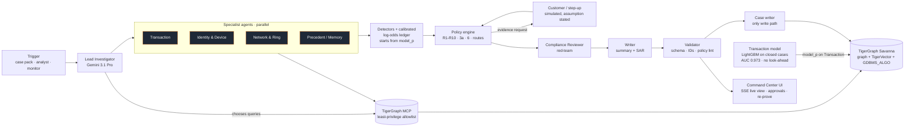

# FraudLens: an agentic fraud investigator on TigerGraph

> **The model predicts. TigerGraph proves.** FraudLens is a team of AI investigators that takes a fraud alert
> (a model score, a customer complaint or an analyst request). It investigates the alert across a TigerGraph
> knowledge graph and remembers every case it has closed. It decides what the bank should do next under the fraud
> policy, asks for more evidence when the signals are uncertain, and writes the case record and the suspicious
> activity report. Every claim it makes carries a GSQL query that anyone can re-run.

Built for the **TigerGraph × Hacker House Goa 2026, Task 4: Agentic Fraud Investigation**.

| | |
|---|---|
| Demo video | _link_ |
| Technical blog | _link_ |
| Answer files | [`cases/`](cases/): 20 files, schema-validated, with IDs checked against the graph |
| Autonomous finds | [`cases_autonomous/`](cases_autonomous/): cases the agent opened with no alert |

---

## What it does in 30 seconds

1. **Trigger.** A case from the case pack, an analyst request in the UI, or the autonomous monitor.
2. **Investigate.** Four specialist agents query TigerGraph through the official **TigerGraph MCP** server, using 18 installed GSQL queries:
   - the transaction window;
   - the card baseline;
   - the resolved cardholder account;
   - device neighbours;
   - region activity;
   - prior cases.

   A Lead Investigator (Gemini) forms hypotheses and chooses extra queries.
3. **Assess.** A transaction model trained only on the bank's own closed cases gives the starting probability. It is a LightGBM that never sees anything after the transaction it scores. On the October hold-out it separates fraud from false alarms with AUC **0.973**; the bank's own risk score reaches 0.866. The score lives on each `Transaction` vertex as `model_p`, so the agent reads it through MCP like any other attribute. Graph findings the model cannot see then move it in a calibrated log-odds ledger:
   - fraud on *other* cards that share a rare device (R6);
   - sub-threshold structuring;
   - card-testing sequences;
   - a recurring charge from the same cardholder (R7);
   - the customer's own dispute.

   Each finding carries a likelihood ratio, the entity IDs it rests on and a replayable query reference. Signals the model already sees are shown but never counted twice. See the [model card](eval/model_card.md).
4. **Decide under policy.** The policy engine is code: R1–R10, section 3a (case vs SAR) and section 6 (stop rule). It computes the next best action and its approval route for every possible customer reply (confirms, denies, no reply). It requests evidence when the policy calls for it, and records the initial and final recommendations and what changed between them.
5. **Remember.** Hybrid GraphRAG combines TigerVector search over 5,565 closed-case narratives, filtered by a graph candidate set (shared devices and cards), with the policy and FinCEN guidance. Every investigation is written back to the graph as an `InvestigationCase`, so the next case can find it.
6. **Govern.** The reasoning agent's MCP access is limited to an explicit allowlist of query and read tools, and a separate case writer is the only thing that writes. `auto` actions run immediately (simulated). `L1` and `L2` actions wait in an approval inbox, and a team lead can't approve a fraud manager's action.
7. **Explain.** A Compliance Reviewer agent red-teams the decision, and a Writer agent produces the analyst summary and a FinCEN-style SAR narrative. A validator rejects any ID that doesn't exist in the graph.

## Architecture



## How TigerGraph is used

| Capability | Where |
|---|---|
| **Schema**: Customer, Card, **Account** (entity-resolved cardholder: card + billing region + account-open day), Transaction, DeviceProfile, EmailDomain, BillingRegion, ClosedCase, PolicyRule, FraudPattern, DocChunk, InvestigationCase, EvidenceRequest, ActionRecord, plus 30 edge types | [`graph/schema.gsql`](graph/schema.gsql) |
| **Loading**: 590,742 transactions, 144,432 identity records, 221,650 resolved accounts, 5,565 closed cases, via chunked loading jobs | [`graph/loading_jobs.gsql`](graph/loading_jobs.gsql), [`graph/setup.py`](graph/setup.py) |
| **18 installed GSQL queries**, each with a description the agent reads through MCP | [`graph/queries/`](graph/queries/) |
| **TigerVector**: 768-d embeddings on ClosedCase, InvestigationCase and DocChunk; `vectorSearch()` with a **graph-built `candidate_set`** (hybrid GraphRAG) | `08_similar_cases.gsql`, `09_search_knowledge.gsql` |
| **Graph algorithms**: a time-windowed Card–RING_LINK–Card projection from rare shared devices, then **`GDBMS_ALGO.community.wcc`** for ring components | `10_build_ring_links.gsql`, `11_ring_components.gsql`, `monitor.py` |
| **TigerGraph MCP 1.0.3**: every agent graph call goes through `tigergraph__run_installed_query`, with a least-privilege `--allowed-tools` allowlist (no schema, loading, DML or raw GSQL tools) and tool-call logging: **244 of 244 calls in the official run went through MCP** | [`agent/graph_client.py`](agent/graph_client.py) |
| **Model scores in the graph**: the calibrated `model_p` is stored on 250,000 `Transaction` vertices (October–December). The model's account- and card-history features are the `Account → Transaction → ClosedCase` paths | [`ml/`](ml/), [`graph/schema_model_score.gsql`](graph/schema_model_score.gsql), `python graph/setup.py scores` |
| **Case memory write-back**: InvestigationCase with edges to transactions, cards, devices, cited cases, rules, patterns, evidence requests and actions | [`agent/case_writer.py`](agent/case_writer.py) |

## Requirement → evidence

| Brief requirement | How FraudLens meets it |
|---|---|
| Triggered by a risk score, a customer report or an analyst | All three `trigger_type`s, plus "New investigation" in the UI and an autonomous monitor |
| Evidence from the graph, transactions, devices, behaviour, prior cases and external sources | Seven core queries per case plus up to three chosen by the LLM; regulator documents in TigerVector |
| Identify the pattern and type, and assess risk | Typed detectors per pattern, including two undocumented ones (structuring, device rings), and a calibrated probability |
| Create and progress a case | `CREATE_CASE` under section 3a; status, verdict, evidence and actions updated; written to the graph |
| Case memory | Hybrid vector + graph retrieval; resolved-account lineage; InvestigationCase write-back. Memory is as-of: every memory query takes the case's open time, so no investigation can recall itself or a case opened after it |
| Gather more evidence through controlled actions | `VERIFY_WITH_CUSTOMER` / `STEP_UP_AUTH` through a permission-gated action gateway; simulated replies stated in `evidence_requests` |
| Recommend or take next actions | Policy engine with all 14 actions and exact routes; counterfactual branches for each reply |
| Policies and permissions | `auto` actions executed; L1/L2 wait for a human; role-checked approval inbox; least-privilege MCP allowlist for the reasoning agent |
| Stop when defensible | Section 6 rule implemented; `stop_reason` recorded |
| Explain | Evidence carries a query ref and entity IDs; rules cited in every reason; compliance red-team; FinCEN-style SAR |
| GSQL + graph algorithms + MCP + GraphRAG + UI | See the table above and [`web/`](web/) |

## Results on the 20 benchmark cases

<!-- RESULTS_TABLE -->
| Case | Trigger | Verdict | p | Pattern | Exposure | SAR | Initial → Final actions | Graph |
|---|---|---|---|---|---|---|---|---|
| [HHG-001](cases/HHG-001.json) | risk score | legitimate | 0.05 | none | $0.00 | — | CREATE_CASE VERIFY_WITH_CUSTOMER **→** ALLOW_TRANSACTION CLOSE_NO_FRAUD | ✅ |
| [HHG-002](cases/HHG-002.json) | risk score | legitimate | 0.05 | none | $0.00 | — | CREATE_CASE VERIFY_WITH_CUSTOMER **→** ALLOW_TRANSACTION CLOSE_NO_FRAUD | ✅ |
| [HHG-003](cases/HHG-003.json) | customer report | fraud | 0.97 | out of region use | $165.93 | — | BLOCK_CARD CREATE_CASE | ✅ |
| [HHG-004](cases/HHG-004.json) | customer report | fraud | 0.76 | card not present new device | $128.33 | — | BLOCK_CARD CREATE_CASE | ✅ |
| [HHG-005](cases/HHG-005.json) | risk score | legitimate | 0.05 | none | $0.00 | — | CREATE_CASE VERIFY_WITH_CUSTOMER **→** ALLOW_TRANSACTION CLOSE_NO_FRAUD | ✅ |
| [HHG-006](cases/HHG-006.json) | customer report | fraud | 0.97 | undocumented | $1,906.07 | ✅ | BLOCK_CARD CREATE_CASE FILE_REPORT ESCALATE_TO_ANALYST | ✅ |
| [HHG-007](cases/HHG-007.json) | risk score | fraud | 0.97 | account takeover | $148.89 | — | CREATE_CASE VERIFY_WITH_CUSTOMER **→** BLOCK_CARD CREATE_CASE | ✅ |
| [HHG-008](cases/HHG-008.json) | customer report | fraud | 0.97 | card not present fraud | $55.68 | — | BLOCK_CARD CREATE_CASE | ✅ |
| [HHG-009](cases/HHG-009.json) | customer report | fraud | 0.97 | card not present fraud | $30.02 | — | BLOCK_CARD CREATE_CASE | ✅ |
| [HHG-010](cases/HHG-010.json) | risk score | legitimate | 0.05 | none | $0.00 | — | CREATE_CASE VERIFY_WITH_CUSTOMER **→** ALLOW_TRANSACTION CLOSE_NO_FRAUD | ✅ |
| [HHG-011](cases/HHG-011.json) | customer report | fraud | 0.97 | card not present new device | $131.30 | ✅ | BLOCK_CARD CREATE_CASE FILE_REPORT MONITOR_CONNECTED_CARDS | ✅ |
| [HHG-012](cases/HHG-012.json) | risk score | legitimate | 0.05 | none | $0.00 | — | CREATE_CASE VERIFY_WITH_CUSTOMER **→** ALLOW_TRANSACTION CLOSE_NO_FRAUD | ✅ |
| [HHG-013](cases/HHG-013.json) | risk score | legitimate | 0.05 | none | $0.00 | — | CREATE_CASE VERIFY_WITH_CUSTOMER **→** ALLOW_TRANSACTION CLOSE_NO_FRAUD | ✅ |
| [HHG-014](cases/HHG-014.json) | analyst request | fraud | 0.97 | undocumented | $187.33 | ✅ | BLOCK_CARD CREATE_CASE FILE_REPORT MONITOR_CONNECTED_CARDS ESCALATE_TO_ANALYST | ✅ |
| [HHG-015](cases/HHG-015.json) | risk score | legitimate | 0.05 | none | $0.00 | — | CREATE_CASE VERIFY_WITH_CUSTOMER **→** ALLOW_TRANSACTION CLOSE_NO_FRAUD | ✅ |
| [HHG-016](cases/HHG-016.json) | customer report | fraud | 0.97 | card not present new device | $59.67 | — | BLOCK_CARD CREATE_CASE | ✅ |
| [HHG-017](cases/HHG-017.json) | risk score | legitimate | 0.05 | none | $0.00 | — | CREATE_CASE VERIFY_WITH_CUSTOMER **→** ALLOW_TRANSACTION CLOSE_NO_FRAUD | ✅ |
| [HHG-018](cases/HHG-018.json) | customer report | fraud | 0.97 | out of region use | $251.53 | — | BLOCK_CARD CREATE_CASE | ✅ |
| [HHG-019](cases/HHG-019.json) | risk score | fraud | 0.97 | card not present new device | $99.92 | ✅ | BLOCK_CARD CREATE_CASE FILE_REPORT MONITOR_CONNECTED_CARDS | ✅ |
| [HHG-020](cases/HHG-020.json) | risk score | legitimate | 0.05 | none | $0.00 | — | CREATE_CASE VERIFY_WITH_CUSTOMER **→** ALLOW_TRANSACTION CLOSE_NO_FRAUD | ✅ |

Average per case: **13.3 graph/retrieval tool calls**, **9,108 LLM tokens**, **121 s**. Every file passes the schema + ID + policy validator.


## Backtest on closed cases (honest numbers)

**The transaction model** is trained on July–September and scored on October, which it never saw. Features use only what the bank knew at transaction time. Details are in the [model card](eval/model_card.md) and [`eval/model_report.json`](eval/model_report.json).

| October hold-out | Bank's risk score | FraudLens model |
|---|---|---|
| AUC, all 100,420 October transactions | 0.866 | **0.973** |
| AUC, alerts the bank scored ≥ 0.5 (n = 5,335) | 0.598 | **0.933** |
| Same, without the bank's score as an input | – | 0.941 / 0.887 |

**The whole agent** is also replayed on October's closed cases as they looked when each alert fired. Memory contains only cases opened before the alert, and the case's own label is masked. The code is in [`eval/backtest.py`](eval/backtest.py) and the output in [`eval/report.json`](eval/report.json).

<!-- BACKTEST_TABLE -->
| Agent replay on October closed cases | Value |
|---|---|
| Cases replayed | 498 (354 confirmed, 144 cleared) |
| Fraud vs false alarm, final probability (AUC) | **0.881** (0.957 on alerts scored ≥ 0.5) |
| Pattern accuracy (confirmed cases, 5 known patterns + undocumented) | **91%** |
| Episode reconstruction (Jaccard vs the case's txn_ids) | **0.82** |
| SAR decision agreement with the bank's filings | **81%** |
| Exposure mean absolute error | $165.83 |

**What the history taught us.** The bank's closed cases follow two exact rules, and the agent now applies both.
- **Pattern** follows channel and device:
  - all-online with any device marked New → `card_not_present_new_device` (100% of 1,076 cases);
  - all-online otherwise → `card_not_present_fraud` (100%);
  - mixed channels → `account_takeover` (100%);
  - card-present in the card's home region → `account_takeover`, and elsewhere or across regions → `out_of_region_use` (95%).
- **An episode** is the fraud on one card, chained while consecutive gaps stay within 48 hours. Between-case gaps on a card are never shorter.

The history is also selection-biased: every cleared case was a high-score model alert, and most confirmed frauds were low-score customer reports. So we report the metrics that history can support, and the model is trained on every transaction, not only on alerts.

## Run it

```bash
python -m venv .venv && .venv/Scripts/activate      # Windows; use source .venv/bin/activate elsewhere
pip install -r requirements.txt
cp .env.example .env                                # TigerGraph Savanna host + Database Secret; GCP project for Vertex AI
python graph/prep.py && python graph/export.py      # derive card_id / accounts / device profiles, export CSVs
python graph/positional.py                          # bind loading-job columns to the CSV headers
python graph/setup.py schema && python graph/setup.py load && python graph/setup.py queries && python graph/setup.py describe
python rag/ingest_docs.py && python rag/embed_cases.py && python graph/setup.py vectors
python -m ml.train                                  # transaction model on the closed cases -> data/prep/model_scores.parquet
python graph/setup.py scores                        # Transaction.model_p on TigerGraph
python graph/setup.py reset_memory --yes          # optional: clear agent-written case memory before an official run
python run_cases.py                                 # investigates all 20 cases -> cases/*.json (+ graph write-back)
python monitor.py                                   # autonomous sweep -> cases_autonomous/
uvicorn api.main:app --port 8000                    # Command Center at http://localhost:8000
```

### The demo film

The film in [`video/`](video/) is built from code. [Playwright](https://playwright.dev) records the live Command Center through the Chrome DevTools screencast at 2560×1440, logging where every element sat on screen at each moment. [Remotion](https://www.remotion.dev) then edits that recording: the camera zooms to the element the narration is talking about, and a time warp speeds through the waits. The narration is Gemini 2.5 Pro TTS (voice Charon) and the music bed is Lyria 2. The finishing pass brings the audio to -14 LUFS.

```bash
cd video && npm install
python voice/make_voice.py && python music/make_music.py
node capture/record.mjs --base http://localhost:8000 --take final
npm run render                                      # out/fraudlens-demo-final.mp4 + .srt + poster
```

## Honesty notes

- Customer and analyst replies are not in the data. The agent simulates them from the evidence and states each assumption in `evidence_requests`.
- The V, C, D, M and `id_` columns are unnamed Vesta features. The agent uses them only as unnamed signals.
- The offline DuckDB mirror (`agent/mirror.py`) implements the same query contracts. It's used only for fast development and the large backtest. Answer files are produced against TigerGraph.
- The transaction model is trained only on labels from `closed_cases_history.csv`. Its features never look past the transaction being scored, and October is held out for every number we report.
- The original public IEEE-CIS files were never used.
