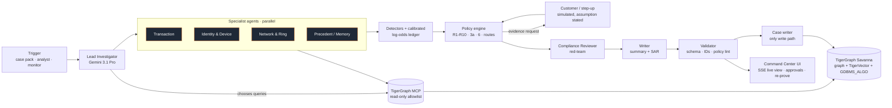

# FraudLens: an agentic fraud investigator on TigerGraph

> **The model predicts. TigerGraph proves.** FraudLens is a team of AI investigators that takes a fraud alert
> (a model score, a customer complaint or an analyst request). It investigates the alert across a TigerGraph
> knowledge graph and remembers every case it has closed. It decides what the bank should do next under the fraud
> policy, asks for more evidence when the signals are uncertain, and writes the case record and the suspicious
> activity report. Every claim it makes carries a GSQL query that anyone can re-run.

Built for the **TigerGraph × Hacker House Goa 2026, Task 4: Agentic Fraud Investigation**.

| | |
|---|---|
| Demo video | _link_ |
| Technical blog | _link_ |
| Answer files | [`cases/`](cases/): 20 files, schema-validated, with IDs checked against the graph |
| Autonomous finds | [`cases_autonomous/`](cases_autonomous/): cases the agent opened with no alert |

---

## What it does in 30 seconds

1. **Trigger.** A case from the case pack, an analyst request in the UI, or the autonomous monitor.
2. **Investigate.** Four specialist agents query TigerGraph through the official **TigerGraph MCP** server, using 17 installed GSQL queries:
   - the transaction window;
   - the card baseline;
   - the resolved cardholder account;
   - device neighbours;
   - region activity;
   - prior cases.

   A Lead Investigator (Gemini) forms hypotheses and chooses extra queries.
3. **Assess.** Detectors produce typed findings, and each finding carries:
   - a likelihood ratio;
   - the entity IDs it rests on;
   - a replayable query reference.

   A calibrated log-odds ledger turns them into a fraud probability. The ledger is fitted on 14,055 fraud and 402,449 background transactions.
4. **Decide under policy.** The policy engine is code: R1–R10, section 3a (case vs SAR) and section 6 (stop rule). It computes the next best action and its approval route for every possible customer reply (confirms, denies, no reply). It requests evidence when the policy calls for it, and records the initial and final recommendations and what changed between them.
5. **Remember.** Hybrid GraphRAG combines TigerVector search over 5,565 closed-case narratives, filtered by a graph candidate set (shared devices and cards), with the policy and FinCEN guidance. Every investigation is written back to the graph as an `InvestigationCase`, so the next case can find it.
6. **Govern.** The reasoning agent's MCP access is **read-only**, and a separate case writer is the only thing that writes. `auto` actions run immediately (simulated). `L1` and `L2` actions wait in an approval inbox, and a team lead can't approve a fraud manager's action.
7. **Explain.** A Compliance Reviewer agent red-teams the decision, and a Writer agent produces the analyst summary and a FinCEN-style SAR narrative. A validator rejects any ID that doesn't exist in the graph.

## Architecture



## How TigerGraph is used

| Capability | Where |
|---|---|
| **Schema**: Customer, Card, **Account** (entity-resolved cardholder: card + billing region + account-open day), Transaction, DeviceProfile, EmailDomain, BillingRegion, ClosedCase, PolicyRule, FraudPattern, DocChunk, InvestigationCase, EvidenceRequest, ActionRecord, plus 30 edge types | [`graph/schema.gsql`](graph/schema.gsql) |
| **Loading**: 590,742 transactions, 144,432 identity records, 221,650 resolved accounts, 5,565 closed cases, via chunked loading jobs | [`graph/loading_jobs.gsql`](graph/loading_jobs.gsql), [`graph/setup.py`](graph/setup.py) |
| **17 installed GSQL queries**, each with a description the agent reads through MCP | [`graph/queries/`](graph/queries/) |
| **TigerVector**: 768-d embeddings on ClosedCase, InvestigationCase and DocChunk; `vectorSearch()` with a **graph-built `candidate_set`** (hybrid GraphRAG) | `08_similar_cases.gsql`, `09_search_knowledge.gsql` |
| **Graph algorithms**: a time-windowed Card–RING_LINK–Card projection from rare shared devices, then **`GDBMS_ALGO.community.wcc`** for ring components | `10_build_ring_links.gsql`, `11_ring_components.gsql`, `monitor.py` |
| **TigerGraph MCP 1.0.3**: every agent graph call goes through `tigergraph__run_installed_query` with `--allowed-tools read-only` and tool-call logging | [`agent/graph_client.py`](agent/graph_client.py) |
| **Case memory write-back**: InvestigationCase with edges to transactions, cards, devices, cited cases, rules, patterns, evidence requests and actions | [`agent/case_writer.py`](agent/case_writer.py) |

## Requirement → evidence

| Brief requirement | How FraudLens meets it |
|---|---|
| Triggered by a risk score, a customer report or an analyst | All three `trigger_type`s, plus "New investigation" in the UI and an autonomous monitor |
| Evidence from the graph, transactions, devices, behaviour, prior cases and external sources | Seven core queries per case plus up to three chosen by the LLM; regulator documents in TigerVector |
| Identify the pattern and type, and assess risk | Typed detectors per pattern, including two undocumented ones (structuring, device rings), and a calibrated probability |
| Create and progress a case | `CREATE_CASE` under section 3a; status, verdict, evidence and actions updated; written to the graph |
| Case memory | Hybrid vector + graph retrieval; resolved-account lineage; InvestigationCase write-back; cases processed in `opened_at` order |
| Gather more evidence through controlled actions | `VERIFY_WITH_CUSTOMER` / `STEP_UP_AUTH` through a permission-gated action gateway; simulated replies stated in `evidence_requests` |
| Recommend or take next actions | Policy engine with all 14 actions and exact routes; counterfactual branches for each reply |
| Policies and permissions | `auto` actions executed; L1/L2 wait for a human; role-checked approval inbox; read-only MCP for the reasoning agent |
| Stop when defensible | Section 6 rule implemented; `stop_reason` recorded |
| Explain | Evidence carries a query ref and entity IDs; rules cited in every reason; compliance red-team; FinCEN-style SAR |
| GSQL + graph algorithms + MCP + GraphRAG + UI | See the table above and [`web/`](web/) |

## Results on the 20 benchmark cases

<!-- RESULTS_TABLE -->

## Backtest on closed cases (honest numbers)

We replay October's closed cases as they looked when each alert fired. Memory contains only cases opened before the alert, and the case's own label is masked. Full details are in [`eval/backtest.py`](eval/backtest.py) and [`eval/report.json`](eval/report.json).

<!-- BACKTEST_TABLE -->

The closed history is selection-biased. Every cleared case was a high-score model alert, and most confirmed frauds came from low-score customer reports. So we report metrics the history can support honestly, and we fitted likelihood ratios against background transactions instead ([`eval/likelihoods.md`](eval/likelihoods.md)).

## Run it

```bash
python -m venv .venv && .venv/Scripts/activate      # Windows; use source .venv/bin/activate elsewhere
pip install -r requirements.txt
cp .env.example .env                                # TigerGraph Savanna host + Database Secret; GCP project for Vertex AI
python graph/prep.py && python graph/export.py      # derive card_id / accounts / device profiles, export CSVs
python graph/setup.py schema && python graph/setup.py load && python graph/setup.py queries
python rag/ingest_docs.py && python rag/embed_cases.py && python graph/setup.py vectors
python run_cases.py                                 # investigates all 20 cases -> cases/*.json (+ graph write-back)
python monitor.py                                   # autonomous sweep -> cases_autonomous/
uvicorn api.main:app --port 8000                    # Command Center at http://localhost:8000
```

## Honesty notes

- Customer and analyst replies are not in the data. The agent simulates them from the evidence and states each assumption in `evidence_requests`.
- The V, C, D, M and `id_` columns are unnamed Vesta features. The agent uses them only as unnamed signals.
- The offline DuckDB mirror (`agent/mirror.py`) implements the same query contracts. It's used only for fast development and the large backtest. Answer files are produced against TigerGraph.
- The original public IEEE-CIS files were never used.
