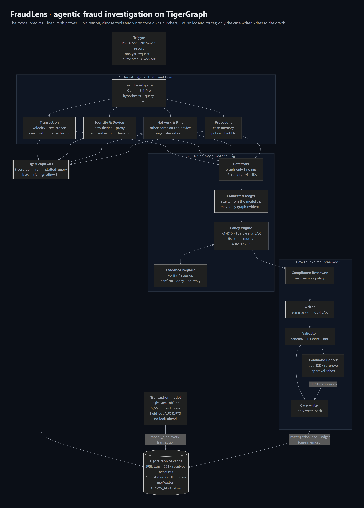

# The model predicts. TigerGraph proves: building an agentic fraud investigator on a graph

*How we built FraudLens for the TigerGraph × Hacker House Goa 2026 challenge: a team of AI investigators that works
through fraud alerts on a TigerGraph knowledge graph, decides the next best action under a real fraud policy, and
backs every claim with a query you can re-run.*

---

## The problem

Fraud analysts spend most of their time collecting evidence, not deciding. For every alert they pull the
transaction history, check the device and the region, look for connected cards, read old cases, re-read the policy,
and write it all up. A risk score doesn't settle an alert. In this dataset the bank's model scored thousands of
transactions above 0.7, and **most of them were legitimate**. Some real fraud scored close to zero.

The challenge gave us 590,742 IEEE-CIS card transactions with no fraud label. It also gave us 5,565 closed
investigations, a five-pattern typology, a ten-rule fraud policy, and 20 alerts to investigate. Our goal was not just a
better classifier (though we trained one). It was an **investigator** that:
- knows what to look at;
- knows when the evidence is not enough and asks for more;
- follows the policy to the letter;
- leaves a record the next investigation can learn from.

## What we built

FraudLens is a virtual fraud team:

- **Lead Investigator** (Gemini 3.1 Pro on Vertex AI). It reads the alert, forms competing hypotheses, and picks extra graph queries from a menu of installed GSQL queries.
- **Four specialist analysts**, running in parallel. Each sees only its slice of the evidence:
  - *Transaction*: velocity, bursts, recurring charges, card testing, structuring.
  - *Identity & Device*: new devices, proxies, the resolved cardholder account.
  - *Network & Ring*: what happened on *other* cards.
  - *Precedent*: closed cases and policy documents.
- **A transaction model** trained only on the bank's 5,565 closed cases (LightGBM, no look-ahead features). Its calibrated score is stored on every `Transaction` vertex in TigerGraph, and it is where each assessment starts.
- **A deterministic core** covering detectors, a calibrated log-odds ledger, and the policy engine. It owns every number, ID, route and SAR decision.
- **Compliance Reviewer**. A red-team agent that checks the draft against the policy before anything is written.
- **Writer**. Produces the analyst summary and a FinCEN-style suspicious activity report.
- **Case writer**. The *only* component allowed to write to the graph.

The LLM reasons, chooses tools and writes. It never sets a probability, an exposure, an approval route or a
transaction ID. A validator rejects any answer that mentions an ID that doesn't exist in TigerGraph.

## Architecture

1. **Trigger**: a model score, a customer report, an analyst request or our autonomous monitor.
2. **Investigate**: seven core GSQL queries, plus up to three the Lead Investigator chooses. All go through the **official TigerGraph MCP server** (`tigergraph__run_installed_query`), started with a least-privilege `--allowed-tools` allowlist (query, vector and read tools only; no schema, loading, DML or raw GSQL) and tool-call logging.
3. **Assess**: the transaction model's calibrated score is the starting point. Detectors then emit typed findings, each with a likelihood ratio, the entity IDs it rests on, and a replayable reference such as `query:card_window(card=C07297-K1, start_ts=…, end_ts=…)`. Only evidence the model can't see moves the probability: other cards, rings, structuring, testing sequences, the customer's own dispute.
4. **Decide**: the policy engine computes the initial action, the evidence request, and **all three counterfactual branches**:
   - the customer confirms (R3);
   - the customer denies (R2);
   - no reply (R4).

   The evidence picks the branch we assume. We record `initial`, `final` and `what_changed`.
5. **Remember**: hybrid GraphRAG over TigerVector. Every investigation is written back as an `InvestigationCase` with edges to its transactions, cards, devices, cited cases, rules and actions.
6. **Govern**: `auto` actions run immediately (simulated). `L1` and `L2` actions wait in an approval inbox, which checks roles: a team lead cannot approve a fraud manager's `FILE_REPORT`.

## How we used TigerGraph

**Schema.**
- Customer → Card → Transaction, with DeviceProfile, EmailDomain and BillingRegion.
- ClosedCase, PolicyRule, FraudPattern and DocChunk for knowledge.
- InvestigationCase, EvidenceRequest and ActionRecord for the agent's own memory. Memory is as-of: `prior_cases`, `similar_cases`, `device_neighbors` and `account_history` only return investigations opened before the case being worked, so no case can recall itself or anything opened after it.

The most useful vertex we added was **Account**. The dataset's `customer_id` is really a card-issuer bucket; one
"customer" has more than 10,000 transactions. We resolve the hidden cardholder account as card + billing region +
account-open day, where the open day comes from the D1 "days since first use" field. That's an entity-resolution
step, and it produced the single strongest signal in the project:

> In October, transactions on accounts that already had a confirmed fraud case were fraud **42%** of the time,
> against a **2.7%** base rate. None of the 144 cleared alerts had it.

We also recovered how the bank derived card IDs: the rank of the card network and type within the customer, which
matches **100%** of the 14,955 closed-case transactions. And we read off two rules the bank's analysts followed
when they closed cases.

**How the bank cut fraud episodes.** It chained fraud on the same *card* while consecutive transactions stayed within
48 hours. A gap between two cases on the same card is never shorter than that. Our episode builder samples that
chain 4,000 times from the model's calibrated per-transaction scores, and keeps every transaction that is in the
chain in at least half of the draws.

**How the bank named patterns.**

| Episode | Pattern | Share of closed cases that follow it |
|---|---|---|
| All online, any device marked New | `card_not_present_new_device` | 100% |
| All online, no device marked New | `card_not_present_fraud` | 100% |
| Mixed channels | `account_takeover` | 100% |
| Card-present, only in the card's home region | `account_takeover` | 95% |
| Card-present elsewhere, or across regions | `out_of_region_use` | 95% |

Applying that rule took our pattern accuracy on October's closed cases from 64% to **91%**.

**18 installed GSQL queries.** Each is described with `UPDATE DESCRIPTION OF QUERY`, so an agent can discover it
through MCP. They include:
- `card_window`, `card_profile` (baseline strictly before the alert, so no look-ahead) and `recurring_match`;
- `account_history`, `device_neighbors`, `region_activity`, `prior_cases`;
- `structuring_scan` and `card_testing_scan`;
- the ring projection;
- a validator that checks every ID we cite.

**TigerVector + graph = hybrid GraphRAG.** We embedded the 5,565 closed-case narratives and 242 chunks of policy,
typology and FinCEN guidance (768-d, Vertex `text-embedding-005`). Plain vector search finds cases that *read*
alike. Our `similar_cases` query first builds a **candidate set by graph traversal**: the closed cases reachable
from the alert's device profile and cards. It then runs `vectorSearch()` inside that set. For the device-ring alert
(HHG-014) this pulled the exact four August–September cases where the same Samsung device profile hit other
cardholders. No text query would have found them.

We ran the same query two ways:

| Search (query text: "shared device ring, anonymous proxy, new device, several cardholders") | Top hits |
|---|---|
| Vector only | CC-2060, CC-3977 (ordinary new-device fraud), CC-3035, CC-4491, CC-2649 |
| Vector inside the graph candidate set | **CC-2985, CC-2971, CC-3035, CC-2649**: exactly the four ring cases |

**Graph algorithms.** For ring discovery we project rare device profiles that appeared as a *new* device on several
cards in a time window into Card–`RING_LINK`–Card edges. We then run TigerGraph's built-in
`GDBMS_ALGO.community.wcc` over the projection. The time window matters: a global WCC over card–device edges
collapses into one giant component, because generic browser profiles connect everything.

## The agentic part: deciding under uncertainty

The policy is code. `policy.plan()` is a pure function that returns the recommendation for every possible reply:

- **Verify, don't block.** HHG-010 is a $1,000.03 online purchase from a device the card had never used, and the bank scored it 0.90. Our transaction model puts it at 0.5%. The agent opens a case and asks the customer to verify (R1), and plans every reply:
  - if the customer confirms, it closes the case (R3);
  - if they deny, it blocks the card and files a SAR, because $1,000.03 is over the $1,000 line (R2, section 3a);
  - if there's no reply, it declines the charge and escalates (R4, R8).

  The evidence points to confirmation, so the case closes as legitimate.
- **Know when to stop.** In the device ring (HHG-014), the same device turns up on 19 other cardholders' cards in eight days, and four confirmed cases from the summer used it too. That independent evidence takes the probability to 0.97. Section 6 says stop and act, so it blocks the card (L1), opens a case, files a SAR (L2), monitors all 19 connected cards and escalates to an analyst. It asks the customer nothing.
- **Case vs report.** The rules come from section 3a. A $128 online fraud gets a case only. Four online purchases of $456–$488 in 30 minutes (HHG-006, $1,906.07) get a case **and** a SAR under R9, because amounts chosen to stay under a $500 threshold match none of the five documented patterns. The agent cites all five earlier structuring cases from the bank's history.
- **"Recurring" has to be the same person.** A customer disputed a $55.68 charge (HHG-008). Other ~$55 charges exist on that card ID, so it looks like R7 (disputed but legitimate). But a `customer_id` here is an anonymised issuer bucket shared by hundreds of people, and those earlier charges came from other e-mail domains and devices. Two of the $55.6 charges came 20 minutes apart that evening, and the model scores the disputed one 0.60. So it's fraud under R2, not a recurring charge.

**Calibration** is a Bayesian log-odds ledger that starts from the model.
- **Model alerts.** The prior is the model's calibrated probability for the flagged transaction. That already includes the bank's score, the identity record and the account's history.
- **Customer disputes.** These start at 0.86: every confirmed case in the bank's history began as a customer report, and we keep a margin for recurring charges. The model's likelihood ratio then moves that.
- **Graph findings.** Each finding the model can't see adds its own ratio, capped per family of evidence.
- **No double counting.** Signals the model already sees, like a new device, a proxy or an unusual amount, stay in the evidence as explanation but are never counted twice.

## What we learned

0. **Measure the core question first.** Our first engine combined hand-set likelihood ratios. On October's high-score alerts, its graph evidence separated fraud from false alarms with an AUC of just 0.55. A gradient-boosted model trained only on the bank's own closed cases reaches **0.933** on those same alerts, where the bank's own score reaches 0.598. Its features never look past the transaction being scored, and October stayed held out. We kept the graph for what a per-transaction model can't see: other cards, rings, precedent and policy.

1. **Graph memory beats better prompts.** Our biggest accuracy gains came from entity resolution and graph-filtered retrieval, not from the LLM.
2. **Keep the LLM away from arithmetic and IDs.** Every hallucination we saw early on was a plausible-looking transaction ID. A validator backed by an `ids_exist` query fixed that for good.
3. **Closed histories are biased.** Every cleared case in this bank's history was a high-score model alert, and most confirmed frauds were low-score customer reports. So a naive backtest rewards a model for ignoring the score. We fitted evidence against background transactions instead, and we report only the metrics that history can support.
4. **Least privilege works for agents.** Read-only MCP for reasoning, a single audited write path, and role-checked approvals made the system easier to trust and to debug.

## Results

**The transaction model on October, which it never saw:** AUC **0.973** on all transactions and **0.933** on alerts the bank scored ≥ 0.5. The bank's own score gets 0.866 and 0.598 on the same transactions ([model card](../eval/model_card.md)).

<!-- BACKTEST_TABLE -->
| Agent replay on October closed cases | Value |
|---|---|
| Cases replayed | 498 (354 confirmed, 144 cleared) |
| Fraud vs false alarm, final probability (AUC) | **0.881** (0.957 on alerts scored ≥ 0.5) |
| Pattern accuracy (confirmed cases, 5 known patterns + undocumented) | **91%** |
| Episode reconstruction (Jaccard vs the case's txn_ids) | **0.82** |
| SAR decision agreement with the bank's filings | **81%** |
| Exposure mean absolute error | $165.83 |

<!-- RESULTS_TABLE -->
| Case | Trigger | Verdict | p | Pattern | Exposure | SAR | Initial → Final actions | Graph |
|---|---|---|---|---|---|---|---|---|
| [HHG-001](cases/HHG-001.json) | risk score | legitimate | 0.05 | none | $0.00 | — | CREATE_CASE VERIFY_WITH_CUSTOMER **→** ALLOW_TRANSACTION CLOSE_NO_FRAUD | ✅ |
| [HHG-002](cases/HHG-002.json) | risk score | legitimate | 0.05 | none | $0.00 | — | CREATE_CASE VERIFY_WITH_CUSTOMER **→** ALLOW_TRANSACTION CLOSE_NO_FRAUD | ✅ |
| [HHG-003](cases/HHG-003.json) | customer report | fraud | 0.97 | out of region use | $165.93 | — | BLOCK_CARD CREATE_CASE | ✅ |
| [HHG-004](cases/HHG-004.json) | customer report | fraud | 0.76 | card not present new device | $128.33 | — | BLOCK_CARD CREATE_CASE | ✅ |
| [HHG-005](cases/HHG-005.json) | risk score | legitimate | 0.05 | none | $0.00 | — | CREATE_CASE VERIFY_WITH_CUSTOMER **→** ALLOW_TRANSACTION CLOSE_NO_FRAUD | ✅ |
| [HHG-006](cases/HHG-006.json) | customer report | fraud | 0.97 | undocumented | $1,906.07 | ✅ | BLOCK_CARD CREATE_CASE FILE_REPORT ESCALATE_TO_ANALYST | ✅ |
| [HHG-007](cases/HHG-007.json) | risk score | fraud | 0.97 | account takeover | $148.89 | — | CREATE_CASE VERIFY_WITH_CUSTOMER **→** BLOCK_CARD CREATE_CASE | ✅ |
| [HHG-008](cases/HHG-008.json) | customer report | fraud | 0.97 | card not present fraud | $55.68 | — | BLOCK_CARD CREATE_CASE | ✅ |
| [HHG-009](cases/HHG-009.json) | customer report | fraud | 0.97 | card not present fraud | $30.02 | — | BLOCK_CARD CREATE_CASE | ✅ |
| [HHG-010](cases/HHG-010.json) | risk score | legitimate | 0.05 | none | $0.00 | — | CREATE_CASE VERIFY_WITH_CUSTOMER **→** ALLOW_TRANSACTION CLOSE_NO_FRAUD | ✅ |
| [HHG-011](cases/HHG-011.json) | customer report | fraud | 0.97 | card not present new device | $131.30 | ✅ | BLOCK_CARD CREATE_CASE FILE_REPORT MONITOR_CONNECTED_CARDS | ✅ |
| [HHG-012](cases/HHG-012.json) | risk score | legitimate | 0.05 | none | $0.00 | — | CREATE_CASE VERIFY_WITH_CUSTOMER **→** ALLOW_TRANSACTION CLOSE_NO_FRAUD | ✅ |
| [HHG-013](cases/HHG-013.json) | risk score | legitimate | 0.05 | none | $0.00 | — | CREATE_CASE VERIFY_WITH_CUSTOMER **→** ALLOW_TRANSACTION CLOSE_NO_FRAUD | ✅ |
| [HHG-014](cases/HHG-014.json) | analyst request | fraud | 0.97 | undocumented | $187.33 | ✅ | BLOCK_CARD CREATE_CASE FILE_REPORT MONITOR_CONNECTED_CARDS ESCALATE_TO_ANALYST | ✅ |
| [HHG-015](cases/HHG-015.json) | risk score | legitimate | 0.05 | none | $0.00 | — | CREATE_CASE VERIFY_WITH_CUSTOMER **→** ALLOW_TRANSACTION CLOSE_NO_FRAUD | ✅ |
| [HHG-016](cases/HHG-016.json) | customer report | fraud | 0.97 | card not present new device | $59.67 | — | BLOCK_CARD CREATE_CASE | ✅ |
| [HHG-017](cases/HHG-017.json) | risk score | legitimate | 0.05 | none | $0.00 | — | CREATE_CASE VERIFY_WITH_CUSTOMER **→** ALLOW_TRANSACTION CLOSE_NO_FRAUD | ✅ |
| [HHG-018](cases/HHG-018.json) | customer report | fraud | 0.97 | out of region use | $251.53 | — | BLOCK_CARD CREATE_CASE | ✅ |
| [HHG-019](cases/HHG-019.json) | risk score | fraud | 0.97 | card not present new device | $99.92 | ✅ | BLOCK_CARD CREATE_CASE FILE_REPORT MONITOR_CONNECTED_CARDS | ✅ |
| [HHG-020](cases/HHG-020.json) | risk score | legitimate | 0.05 | none | $0.00 | — | CREATE_CASE VERIFY_WITH_CUSTOMER **→** ALLOW_TRANSACTION CLOSE_NO_FRAUD | ✅ |

Average per case: **13.3 graph/retrieval tool calls**, **9,108 LLM tokens**, **121 s**. Every file passes the schema + ID + policy validator.

## What we'd improve with more time

- Learn the remaining graph-only likelihood ratios (rings, shared devices, recurrence) jointly with the transaction model, using graph features such as FastRP embeddings of the card–device–account neighbourhood computed in TigerGraph.
- Stream new transactions into TigerGraph and run the monitor continuously instead of as a sweep.
- Replace simulated customer replies with a real two-way channel, and learn which verification step (OTP vs call) resolves which alert type fastest.
- Use Louvain communities over the full shared-entity graph to find rings that share emails or regions, not only devices.

*Code, answer files and the demo video: [GitHub](#). Built with TigerGraph Savanna, TigerGraph MCP, GSQL, TigerVector
and Gemini on Vertex AI.* @TigerGraphDB
